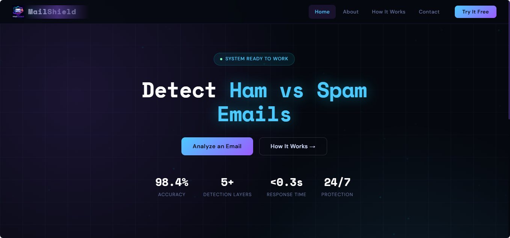
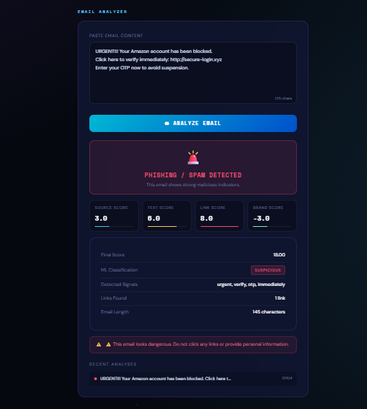
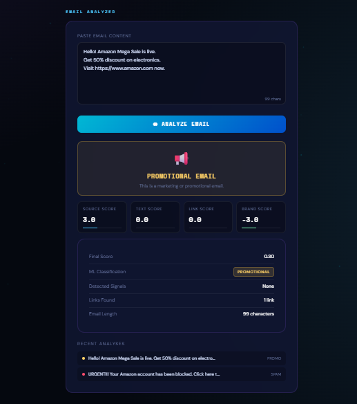

<p align="center">
  
</p>

#  Mail Shield — Spam vs Ham Email Classifier

## 🔹 Project Introduction

Mail Shield is an AI-powered Spam vs Ham Email Classifier designed to detect suspicious, promotional, phishing, and safe emails in real time.

The system combines Heuristic Security Analysis with Machine Learning techniques to provide accurate and explainable email classification. Unlike traditional spam filters, Mail Shield analyzes sender domains, suspicious links, email text patterns, and brand impersonation attempts using a multi-layered defense algorithm.

The project aims to improve email security and protect users from phishing attacks, malicious links, and online fraud.

---

# 🔹 Screenshots

## 🏠 Home Page

<p align="center">
  
</p>

---

## 🚨 Spam Detection Result

<p align="center">
  
</p>

---

## ✅ Ham Detection Result
 ### Normal Detection Result

<p align="center">
  
</p>

 ### Promotional Detection Result
<p align="center">
  
</p>

---

# ✨ Features

✅ Real-Time Email Analysis  
✅ Spam vs Ham Classification  
✅ Promotional Email Detection  
✅ Source / Sender Verification  
✅ Suspicious Link Detection  
✅ Brand Impersonation Detection  
✅ NLP-Based Text Analysis  
✅ TF-IDF Vectorization  
✅ Logistic Regression Machine Learning Model  
✅ Weighted Scoring Engine  
✅ User-Friendly Flask Web Interface  
✅ Detailed Risk Score Breakdown  

---
# ⚙️ How It Works

Mail Shield follows a **6-stage Multi-Layered Defense Algorithm**.

```text
Email Input
     │
     ▼
┌──────────────────────┐
│ 1. INPUT PROCESSING  │
│ Email cleaning       │
│ Lowercasing          │
│ Metadata extraction  │
└──────────┬───────────┘
           │
           ▼
┌──────────────────────┐
│ 2. SOURCE CHECK      │
│ Sender verification  │
│ Lookalike detection  │
└──────────┬───────────┘
           │
           ▼
┌──────────────────────┐
│ 3. LINK ANALYZER     │
│ URL extraction       │
│ Suspicious links     │
│ Shortened URLs       │
└──────────┬───────────┘
           │
           ▼
┌──────────────────────┐
│ 4. NLP TEXT ANALYSIS │
│ TF-IDF Vectorization │
│ Spam keyword scan    │
└──────────┬───────────┘
           │
           ▼
┌──────────────────────┐
│ 5. MACHINE LEARNING  │
│ Logistic Regression  │
│ Spam probability     │
└──────────┬───────────┘
           │
           ▼
┌──────────────────────┐
│ 6. FINAL FUSION      │
│ Weighted Scoring     │
│ Safe / Promo / Spam  │
└──────────────────────┘
```

# 🔐 Multi-Layered Defense Algorithm

The system works using multiple intelligent layers:

### 1. Source Check
* Validates sender domains
* Detects fake or lookalike domains
* Checks trusted registries

### 2. Link Analyzer
* Extracts URLs from emails
* Detects suspicious or shortened links
* Identifies risky domains

### 3. NLP Text Analysis
* Detects spam patterns
* Analyzes urgency-based language
* Uses TF-IDF Vectorization

### 4. Machine Learning Prediction
* Logistic Regression model
* Predicts spam probability
* Provides intelligent classification

### 5. Weighted Scoring Engine
* Combines all layer scores
* Generates final verdict:
  - Safe
  - Promotional
  - Spam / Phishing

---

# 💻 Technologies Used

## Frontend
* HTML5
* CSS3
* JavaScript

## Backend
* Python
* Flask

## Machine Learning
* Scikit-learn
* Logistic Regression
* TF-IDF Vectorizer

## Other Libraries
* Pickle
* Regex (re)
* Pandas
* NumPy

---

# 📂 Professional Folder Structure

```bash
Mail-Shield/
│
├── README.md
│
├── assets/
│   │
│   ├── logo/
│   │   └── logo.jpeg
│   │
│   └── screenshots/
│       ├── homepage.png
│       ├── spam_result.png
│       ├── ham_result.png
│       └── promotional_result.png
│
├── project-assets/
│   │
│   ├── presentation/
│   │   └── Mail_Shield_Presentation.pptx
│   │
│   ├── report/
│   │   └── Mail_Shield_Report.pdf
│   │
│   ├── poster/
│   │   └── Mail_Shield_Poster.png
│   │
│   └── promotional-video/
│       └── demo_video.mp4
│
├── source-code/
│   │
│   ├── app.py
│   ├── requirements.txt
│   │
│   ├── core/
│   │   ├── source_check.py
│   │   ├── link_analyzer.py
│   │   ├── text_nlp.py
│   │   ├── brand_checker.py
│   │   └── scoring_engine.py
│   │
│   ├── ml/
│   │   ├── model.pkl
│   │   ├── vectorizer.pkl
│   │   └── train_model.py
│   │
│   ├── dataset/
│   │   └── spam_ham_dataset.csv
│   │
│   ├── templates/
│   │   └── index.html
│   │
│   └── static/
│          └── style.css
│         └── main.js
│          └── logo.png


```

# 🚀 Setup Instructions

## 1️⃣ Clone Repository

```bash
git clone https://github.com/yourusername/Mail-Shield.git
cd Mail-Shield
```

---

## 2️⃣ Install Dependencies

```bash
pip install -r Source-code/requirements.txt
```

---

## 3️⃣ Run Flask Server

```bash
cd Source-code
python app.py
```

---

## 4️⃣ Open Browser

```text
http://127.0.0.1:5000
```

---

# 🎯 Target Audience

Mail Shield is designed for:

* Small & Medium Businesses
* Educational Institutions
* Remote Work Companies
* Email Service Providers
* Non-Technical Users
* Cybersecurity Awareness Platforms

---

# 👥 Team Information

## NLP Semester Project

### Presented By:

| Name | Roll Number |
|---|---|
| Zainab Shaheen | 8583 |
| Tooba Ilyas | 8584 |
| Mahnoor Safdar | 8627 |

---

# 🛡 Mail Shield

### “Secure Inbox. Smarter Detection.”

Built with ❤️ for NLP & Cybersecurity
